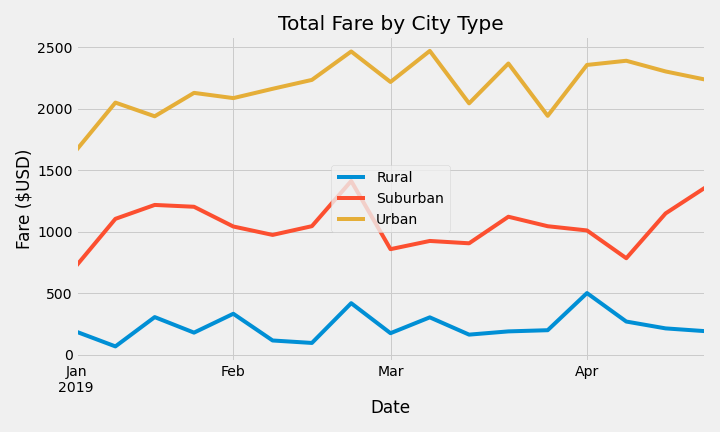
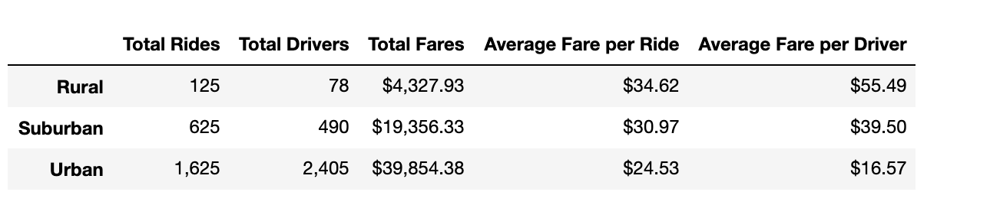

# PyBer_Analysis

## Project Overview
The purpose of this project is to examine PyBer ride-sharing data and break the analysis down by city type.  A Pandas DataFrame was created and then a summary line chart utilizing Matplotlib functionality is employed to provide displays of the differences of the ride sharing data by city type and week fares.  Insights into these trends are then used to provide guidance for decisions by PyBer leadership.

### Results

#### Fare summary by city type
PyBer weekly fares vary significantly depending on whether the city type is rural, suburban, or urban.  As is diplayed in figure 1, urban cities **(gold line)** generate more total weekly fares than suburban and rural combined.  Rural cities generate the least amount of fare on a weekly basis rarely exceeding $500.  Suburban cities tend to be about double the rural cities in weekly fares, but approximately half of the urban cites.
Figure 1 
#### Ride and summary table
If we examine the table in figure 2, we notice that the average fare for the rural cities is the largest, while the smallest average fare per ride is in the urban cities.  This makes sense considering the distance traveled in urban centers is often less as the urban cities are often most dense with destinations more closely spaced.  Again suburban cities fall in the middle.  Of note is also the total drivers vs total rides.  There are more drivers in the urban cities than total rides.  There appears to be not enough demand on the drivers in the urban cities as there are only 1,625 total rides vs 2,405 total drivers.  In comparison, rural and suburban cities have total rides exceeding the number of drivers.  This is also reflected in the average fare per driver column and the end of the table in figure 2. Again, the total fares in the urban cities exceeds the sum of both the suburban and rural cities combined.  
Figure 2 
### Summary
From the data provided, the urban cities are generating over 50% of the revenue for the time period evaluated.  A few follow-up items would be good to examine to be sure that the weeks reviewed and the city type designation is clear.
1. The line graph in figure 1 looks primarily at the January to May period.  Depending on the location of the cities, it might be good to see if this changes throughout the year.  If some locations see more summer of fall requests the data could look significantly different.  The graphs don't show much change from January to May in the period examined.
2. How are the city types defined?  Is there a relationship of suburban cities near urban cities that could combine trip?  How are the profit margins in each city type?  Would more advertising in suburban areas lead to more revenue?  Are the rural cities worth focusing on consideirng their limited revenue?
3.  There seems to be an excess of drivers in the urban cities.  With the reduced average fare are the drivers seeing enough revenue to continue driving?  It might be good to be more restrictive in allowing additional drivers to join as the lack of revenue may lead to a unfortunate drop in drivers if they are not active enough.

